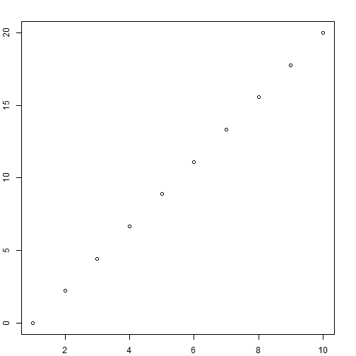
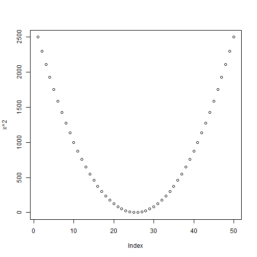
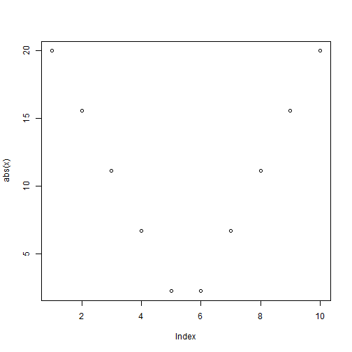
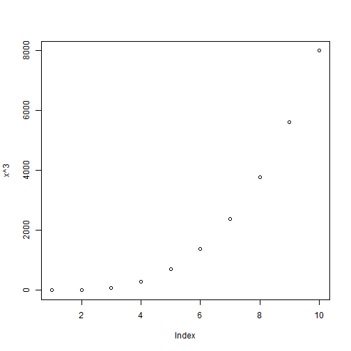

---
title       : Plotting Basic Functions & Curves in R
subtitle    : Shiny App
author      : lwebzem
job         : student
framework   : io2012        # {io2012, html5slides, shower, dzslides, ...}
highlighter : highlight.js  # {highlight.js, prettify, highlight}
hitheme     : tomorrow      # 
widgets     : []            # {mathjax, quiz, bootstrap}
mode        : selfcontained # {standalone, draft}
knit        : slidify::knit2slides

--- .class #id 

## Plotting linear function in R


```r
 par(mar = c(2.0, 2.0, 2.0, 2.0)+0.1)
    x <- seq (0, 20, length = 10)
    plot(x)
```

 

--- .class #id 

## Plotting parabola


```r
x <- seq (-50, 50, length = 50)
    plot(x^2)
```

 

--- .class #id 

## Plotting |x|


```r
 x <- seq (-20, 20, length = 10)
    plot(abs(x))
```

 

--- .class #id 

## Plotting a cubic function

```r
 x <- seq (0, 20, length = 10)
    plot(x^3)
```

 

--- .class #id 


